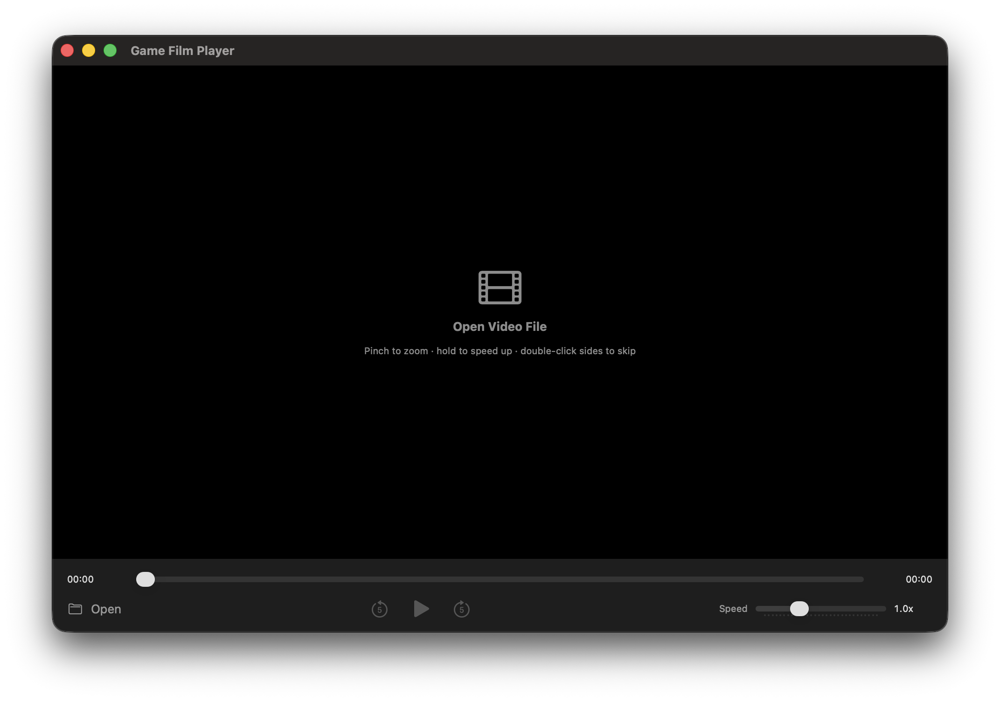
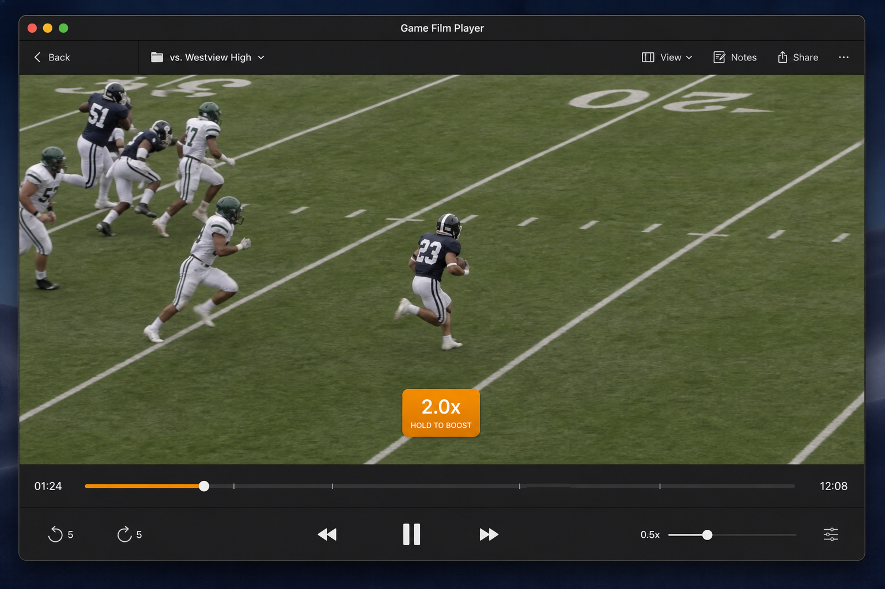

<p align="center">
  
</p>

<h1 align="center">Game Film Player</h1>

<p align="center">
  A native macOS video player built for film study — slow motion, quick skips, cursor-anchored zoom, and hold-to-speed.
</p>

<p align="center">
  <a href="LICENSE"></a>
  <a href="https://github.com/bilalsattar24/game-film-player-mac/actions/workflows/ci.yml"></a>
  
  
  
</p>

---

## Why Game Film Player?

Most video players are built for watching movies. **Game Film Player** is built for **reviewing footage** — coaches, athletes, and analysts who need to scrub frame-by-frame, jump back five seconds to rewatch a play, slow things down to 0.25×, or pinch-zoom into a specific player without fighting the UI.

It's a lightweight, sandboxed macOS app with **no accounts, no cloud, and no dependencies**. Open a local file and start studying.

## Screenshots

| Welcome | Playback |
|---------|----------|
|  |  |

To refresh these images, see [`docs/screenshots/README.md`](docs/screenshots/README.md).

## Features

- **Local file playback** — open any video on your Mac via the system file picker
- **±5 second skip** — buttons, arrow keys, or double-click the left/right side of the video
- **Variable speed** — set a base rate from **0.1× to 3.0×** with a slider
- **Hold to boost** — click and hold on the video to temporarily speed up (2×, or 3× if your base rate is already ≥ 2×); release to return to your chosen speed
- **Cursor-anchored pinch zoom** — zoom toward your pointer, like Maps or Preview
- **Pan when zoomed** — drag to reposition the frame after zooming in
- **Scrubber with timecodes** — seek anywhere in the clip
- **Keyboard shortcuts** — space, arrows, and more (see below)

## Keyboard shortcuts

| Key | Action |
|-----|--------|
| `Space` | Play / Pause |
| `←` | Skip back 5 seconds |
| `→` | Skip forward 5 seconds |

## Requirements

- **macOS 15.2** or later
- **Xcode 16** or later (to build from source)

## Getting started

### Build from source

```bash
git clone https://github.com/bilalsattar24/game-film-player-mac.git
cd game-film-player-mac
open "Game Film Player.xcodeproj"
```

In Xcode, select **My Mac** as the run destination and press **⌘R**.

### Build from the command line

```bash
xcodebuild \
  -project "Game Film Player.xcodeproj" \
  -scheme "Game Film Player" \
  -destination 'platform=macOS' \
  build
```

### Run without opening Xcode

After building once in Xcode:

```bash
open ~/Library/Developer/Xcode/DerivedData/Game_Film_Player-*/Build/Products/Debug/Game\ Film\ Player.app
```

You can drag the `.app` to `/Applications` for everyday use.

## Usage tips

1. Click **Open** and choose a video file.
2. Use the **speed slider** to set your normal review rate (e.g. 0.5× for slow motion).
3. **Hold** on the video to temporarily boost speed while scanning for a moment.
4. **Pinch** on the trackpad to zoom; **drag** to pan when zoomed in.
5. **Double-click** the left or right half of the video to jump ±5 seconds.

## Project structure

```
Game Film Player/
├── ContentView.swift      # UI, gestures, controls
├── PlayerModel.swift      # AVPlayer lifecycle & playback logic
├── PlayerLayerView.swift  # Custom AVPlayerLayer (no AVKit chrome)
└── Game_Film_PlayerApp.swift
```

## Contributing

Contributions are welcome! Please read [CONTRIBUTING.md](CONTRIBUTING.md) before opening a pull request.

- [Report a bug](.github/ISSUE_TEMPLATE/bug_report.md)
- [Request a feature](.github/ISSUE_TEMPLATE/feature_request.md)

This project follows the [Contributor Covenant](CODE_OF_CONDUCT.md).

## Roadmap ideas

- Frame-by-frame stepping (`<` / `>`)
- Bookmark / clip markers on the timeline
- Remember last opened file and playback position
- Drag-and-drop to open videos

Have an idea? [Open an issue](https://github.com/bilalsattar24/game-film-player-mac/issues/new/choose).

## License

This project is licensed under the [MIT License](LICENSE).

## Acknowledgments

Built with SwiftUI and AVFoundation on macOS. Designed for coaches, players, and anyone who watches game film more than Netflix.
